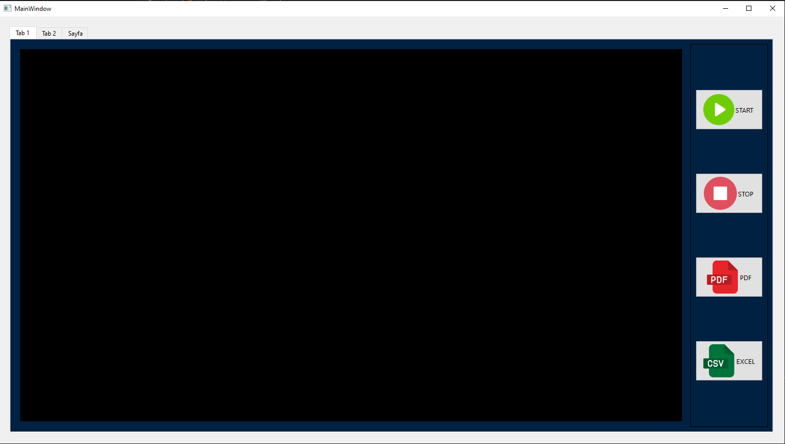
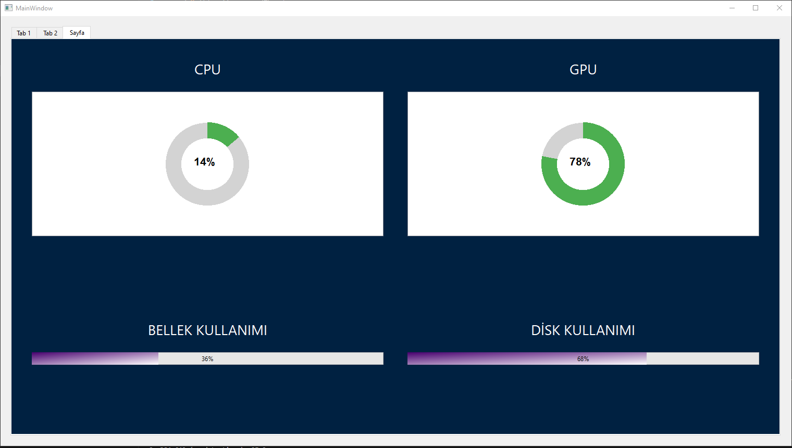

# YOLO ile Nesne Tabanlı Hacim Hesaplama Sistemi

Bu proje, derin öğrenme tabanlı YOLO (You Only Look Once) algoritmasını kullanarak gerçek zamanlı nesne tespiti ve hacim hesaplama yapabilen bir uygulamadır. PyQt6 arayüzü ile kullanıcı dostu bir deneyim sunar.

## Özellikler

- Gerçek zamanlı nesne tespiti ve takibi
- Otomatik hacim hesaplama
- Kullanıcı dostu arayüz
- Ölçüm sonuçlarını kaydetme ve dışa aktarma
- Sistem kaynaklarını izleme
- PDF rapor oluşturma

## Kurulum

1. Gereksinimleri yükleyin:

```bash
pip install -r requirements.txt
```

2. Uygulamayı çalıştırın:

```bash
python main.py
```

## Kullanım

1. Uygulamayı başlattığınızda ana ekran karşınıza gelecektir.
2. Kamera bağlantısını başlatmak için "Kamerayı Başlat" butonuna tıklayın.
4. Ölçüm sonuçlarını kaydedebilir veya PDF olarak dışa aktarabilirsiniz.

## Ekran Görüntüleri

### Ana Ekran


### Kamera Görüntüsü


### Sistem Bilgileri


## Gereksinimler

- Python 3.8+
- OpenCV
- PyQt6
- PyTorch
- Pyrealsense2
- CUDA desteği (GPU hızlandırma için önerilir)


